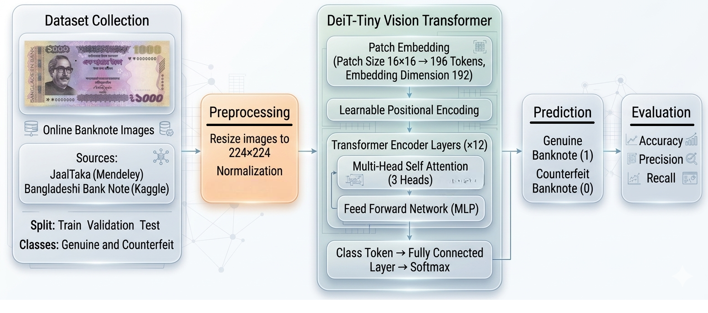

# NoteCheck 💵🔍

<div align="center">

[](https://fastapi.tiangolo.com)
[](https://pytorch.org)
[](https://reactjs.org)
[](https://vitejs.dev)
[](https://render.com)
[](LICENSE)

**An End-to-End AI-Powered Banknote Counterfeit Detection System**  
*Vision Transformer (DeiT) Backbone • Automated 4-Point Perspective Rectification • CLAHE Lighting Equalization • FastAPI REST API • Interactive React Web Dashboard*

</div>

---

## 📖 Table of Contents

- [📌 Overview](#-overview)
- [✨ Key Capabilities](#-key-capabilities)
- [🏗️ System Architecture](#️-system-architecture)
- [📁 Repository Structure](#-repository-structure)
- [🚀 Local Development Setup](#-local-development-setup)
  - [Prerequisites](#prerequisites)
  - [Option 1: One-Click Windows Launch](#option-1-one-click-windows-launch)
  - [Option 2: Step-by-Step Manual Setup](#option-2-step-by-step-manual-setup)
  - [Default Test Credentials](#default-test-credentials)
- [📡 API Documentation](#-api-documentation)
  - [Interactive Swagger & Redoc](#interactive-swagger--redoc)
  - [Endpoint Reference](#endpoint-reference)
  - [Prediction Request & Response Example](#prediction-request--response-example)
  - [Quick cURL Examples](#quick-curl-examples)
- [☁️ Production Deployment (Render)](#️-production-deployment-render)
- [📊 Model Performance & Research](#-model-performance--research)
- [🛡️ License & Acknowledgements](#️-license--acknowledgements)

---

## 📌 Overview

**NoteCheck** is an end-to-end computer vision and deep learning platform designed to verify banknote authenticity in real-time with **~97.88% accuracy**.

Detecting counterfeit currency from arbitrary camera angles and mobile phone snapshots presents significant challenges—distracting backgrounds (such as office desks, tablecloths, or hands), uneven illumination, perspective tilt, and micro-print distortions. 

NoteCheck resolves these challenges through a two-stage pipeline:
1. **Automated OpenCV Stage**: Intelligently segments the banknote from cluttered backgrounds, corrects camera tilt via 4-point homography perspective warping, aligns orientation horizontally, and normalizes harsh shadows using CLAHE.
2. **Vision Transformer (DeiT) Stage**: Leverages a fine-tuned `deit_tiny_patch16_224` backbone to analyze visual patterns, micro-textures, and watermark characteristics to render high-confidence authenticity classifications.



---

## ✨ Key Capabilities

* 🧠 **Vision Transformer Backbone**: `deit_tiny_patch16_224` fine-tuned specifically for fine-grained banknote feature extraction and counterfeit discrimination.
* 📐 **Automated Perspective Rectification**: Built-in computer vision engine executing bilateral filtering, Canny edges, Otsu morphological gradients, aspect-ratio gating (1.15–3.2), and 4-point homography transformation.
* ☀️ **CLAHE Lighting Normalization**: Contrast Limited Adaptive Histogram Equalization applied in LAB color space to equalize shadows, harsh reflections, and variable ambient lighting.
* ⚡ **High-Throughput FastAPI REST Backend**: Asynchronous endpoints supporting JWT authentication, transparent token refreshing, database scan logging, and administrative analytics.
* 🔐 **Enterprise Auth & RBAC**: Password hashing via `bcrypt`, access tokens (60 min), refresh tokens (7 days), and role-based permissions (`user`, `staff`, `admin`).
* 💻 **Modern React Dashboard**: Built with React 18, Vite, and Lucide icons—featuring live image dropzones, side-by-side cropped note previews, animated confidence gauges, scan history, and administrative telemetry.
* ☁️ **Ready for Cloud Deployment**: Out-of-the-box Render Blueprint configuration (`render.yaml`) optimized with lightweight CPU PyTorch wheels.

---

## 🏗️ System Architecture

```text
┌─────────────────────────┐
│ User Capture / Upload   │
└────────────┬────────────┘
             │
             ▼
┌────────────────────────────────────────────────────────┐
│ OpenCV Preprocessing & Rectification Pipeline          │
│ • Bilateral Filtering (noise suppression)              │
│ • Canny & Morphological Gradient Contouring            │
│ • Aspect Ratio & Convexity Validation                  │
│ • 4-Point Homography Perspective Warping               │
│ • Horizontal Auto-Rotation (width >= height)           │
│ • LAB + CLAHE Illumination & Contrast Equalization     │
└────────────┬───────────────────────────────────────────┘
             │
             ▼
┌────────────────────────────────────────────────────────┐
│ DeiT Vision Transformer (deit_tiny_patch16_224)        │
│ • Input Resolution: 224 x 224 px                       │
│ • Patch Extraction & Self-Attention Encoders           │
│ • Softmax Classification Head                          │
└────────────┬───────────────────────────────────────────┘
             │
             ▼
┌────────────────────────────────────────────────────────┐
│ FastAPI REST Service + SQLite ORM                      │
│ • Authenticates via JWT Bearer tokens                  │
│ • Logs telemetry (latency, confidence, user_id)        │
│ • Returns prediction, probabilities & Base64 preview   │
└────────────┬───────────────────────────────────────────┘
             │
             ▼
┌────────────────────────────────────────────────────────┐
│ React Web Application (Vite + Tailwind CSS)            │
│ • Live authentic/counterfeit verdict with score        │
│ • Side-by-side original vs. perspective crop preview   │
│ • Scan history table & admin monitoring dashboard      │
└────────────────────────────────────────────────────────┘
```

---

## 📁 Repository Structure

```text
NoteCheck/
├── backend/
│   ├── models/
│   │   └── best_deit.pth              # Pretrained DeiT PyTorch model weights (22MB)
│   ├── auth.py                        # JWT lifecycle, token refresh & bcrypt hashing
│   ├── database.py                    # SQLAlchemy ORM models & SQLite connection
│   ├── main.py                        # FastAPI REST API application & endpoints
│   ├── model_loader.py                # CV preprocessing & DeiT inference engine
│   └── requirements.txt               # Backend Python dependencies
├── frontend/
│   ├── src/
│   │   ├── App.jsx                    # Primary React application component
│   │   ├── main.jsx                   # React entrypoint
│   │   └── index.css                  # Design styles and custom CSS
│   ├── public/                        # Static assets and icons
│   ├── .env.development               # Local development environment config
│   ├── .env.production.example        # Cloud production environment template
│   ├── index.html                     # Vite HTML entrypoint
│   ├── package.json                   # Node.js dependencies & scripts
│   └── vite.config.js                 # Vite build & proxy settings
├── counterfeit-detection-accuracy-97-88.ipynb # Model training & evaluation notebook
├── Counterfeit_Banknote_Detection_1.pdf        # Research paper documentation
├── IEEE_Counterfeit_Detection_Paper.docx       # IEEE conference publication draft
├── CM.png                             # Confusion Matrix evaluation plot
├── ROC.png                            # ROC Curve evaluation plot
├── final_methodology_figure.png       # Pipeline architectural methodology diagram
├── RENDER_DEPLOYMENT.md               # Cloud deployment guide for Render.com
├── render.yaml                        # Render Infrastructure Blueprint specification
├── run_app.bat                        # One-click Windows launch script
├── .gitignore                         # Git exclusion rules
└── README.md                          # Project documentation
```

---

## 🚀 Local Development Setup

### Prerequisites

Ensure the following runtimes are installed on your machine:
* **Python**: 3.10 or higher ([Download Python](https://www.python.org/downloads/))
* **Node.js**: 18 or higher & **npm** ([Download Node.js](https://nodejs.org/))
* **Git**: ([Download Git](https://git-scm.com/))

---

### Option 1: One-Click Windows Launch

If you are on Windows, simply double-click or run:

```cmd
run_app.bat
```

This script will automatically:
1. Activate the Python virtual environment in `backend/` and start Uvicorn on `http://127.0.0.1:8000`.
2. Launch the Vite development server in `frontend/` on `http://localhost:5173`.

---

### Option 2: Step-by-Step Manual Setup

#### 1. Clone the Repository
```bash
git clone https://github.com/CUET-Synesis-IT/NoteCheck.git
cd NoteCheck
```

#### 2. Backend Setup
```bash
cd backend

# Create virtual environment
python -m venv venv

# Activate virtual environment
# On Windows (PowerShell/CMD):
venv\Scripts\activate
# On Linux/macOS:
# source venv/bin/activate

# Upgrade pip and install dependencies
pip install --upgrade pip
pip install -r requirements.txt

# Start the FastAPI server
uvicorn main:app --reload --host 127.0.0.1 --port 8000
```
The backend will be live at `http://127.0.0.1:8000`.

#### 3. Frontend Setup
Open a new terminal window:
```bash
cd frontend

# Install Node dependencies
npm install

# Start Vite development server
npm run dev
```
The React UI will be live at `http://localhost:5173`.

---

### Default Test Credentials

Upon startup, the backend automatically seeds a default administrative account:

| Field | Value |
| :--- | :--- |
| **Email** | `admin@jaaltaka.com` |
| **Password** | `Admin123!` |
| **Role** | `admin` (Access to Analytics & System Scans) |

You can also register any new standard user account directly from the UI.

---

## 📡 API Documentation

### Interactive Swagger & Redoc

Once the backend is running, complete interactive OpenAPI documentation is accessible at:
* **Swagger UI**: [http://127.0.0.1:8000/docs](http://127.0.0.1:8000/docs)
* **ReDoc**: [http://127.0.0.1:8000/redoc](http://127.0.0.1:8000/redoc)

---

### Endpoint Reference

| Method | Endpoint | Access | Description |
| :--- | :--- | :--- | :--- |
| `GET` | `/health` | Public | Check service & model loaded status |
| `POST` | `/auth/register` | Public | Register a new user account |
| `POST` | `/auth/login` | Public | Authenticate with JSON credentials & get JWT tokens |
| `POST` | `/auth/token` | Public | OAuth2-compliant login form (for Swagger UI "Authorize") |
| `POST` | `/auth/refresh` | Public | Exchange refresh token for fresh access token |
| `GET` | `/auth/me` | Authenticated | Retrieve current user profile and role |
| `POST` | `/predict` | Authenticated | Process banknote image, perform CV rectification & return prediction |
| `GET` | `/history` | Authenticated | Fetch recent scan history for logged-in user |
| `GET` | `/admin/overview` | Admin Only | Global telemetry (total scans, fake rate, 30-day trends) |
| `GET` | `/admin/scans` | Admin Only | Global audit log of all system scans |
| `GET` | `/admin/users` | Admin Only | List all registered platform users |
| `PATCH`| `/admin/users/{id}/role` | Admin Only | Change a user's role (`user`, `staff`, `admin`) |

---

### Prediction Request & Response Example

#### Request:
`POST /predict`  
**Headers**: `Authorization: Bearer <access_token>`  
**Body**: `multipart/form-data` with key `file` (image file).

#### Response (`200 OK`):
```json
{
  "prediction": "genuine",
  "confidence": 0.9842,
  "probabilities": {
    "counterfeit": 0.0158,
    "genuine": 0.9842
  },
  "inference_time_ms": 46.85,
  "note_detected_and_cropped": true,
  "cropped_banknote_base64": "data:image/jpeg;base64,/9j/4AAQSkZJRg...",
  "scan_id": 142
}
```

---

### Quick cURL Examples

#### 1. Login to Receive JWT
```bash
curl -X POST "http://127.0.0.1:8000/auth/login" \
     -H "Content-Type: application/json" \
     -d '{"email": "admin@jaaltaka.com", "password": "Admin123!"}'
```

#### 2. Analyze a Banknote Image
```bash
curl -X POST "http://127.0.0.1:8000/predict" \
     -H "Authorization: Bearer YOUR_ACCESS_TOKEN" \
     -F "file=@/path/to/banknote_sample.jpg"
```

---

## ☁️ Production Deployment (Render)

NoteCheck is pre-configured with a **Render Blueprint** (`render.yaml`) for one-click deployment:

1. Push your code to GitHub.
2. In the [Render Dashboard](https://dashboard.render.com), click **New +** $\rightarrow$ **Blueprint**.
3. Select your repository (`CUET-Synesis-IT/NoteCheck`).
4. Render will automatically read `render.yaml` and provision:
   * **`notecheck-backend`**: FastAPI web service using lightweight CPU-only PyTorch.
   * **`notecheck-frontend`**: React static site hosted on Render's global CDN.
5. In the `VITE_API_BASE` field, provide your backend URL (e.g., `https://notecheck-backend.onrender.com`).
6. Click **Deploy Blueprint**.

For full deployment instructions, refer to the [Render Deployment Guide](RENDER_DEPLOYMENT.md).

---

## 📊 Model Performance & Research

The classification engine uses a Data-efficient Image Transformer (`deit_tiny_patch16_224`) trained and evaluated on authentic and counterfeit banknote datasets.

| Metric | Score |
| :--- | :--- |
| **Model Architecture** | DeiT (Vision Transformer) |
| **Validation Accuracy** | **97.88%** |
| **Input Image Resolution** | 224 x 224 pixels |
| **Average End-to-End Latency** | ~40 – 75 ms (CV crop + Inference) |
| **Classes** | `counterfeit` (Class 0), `genuine` (Class 1) |

* Detailed training code, loss convergence, and evaluation loops are documented in [`counterfeit-detection-accuracy-97-88.ipynb`](counterfeit-detection-accuracy-97-88.ipynb).
* Formal research drafts are available in [`Counterfeit_Banknote_Detection_1.pdf`](Counterfeit_Banknote_Detection_1.pdf) and [`IEEE_Counterfeit_Detection_Paper.docx`](IEEE_Counterfeit_Detection_Paper.docx).

---

## 🛡️ License & Acknowledgements

* **License**: Licensed under the [MIT License](LICENSE).
* **Research**: Developed under the CUET & Synesis IT research initiative for automated currency verification.
